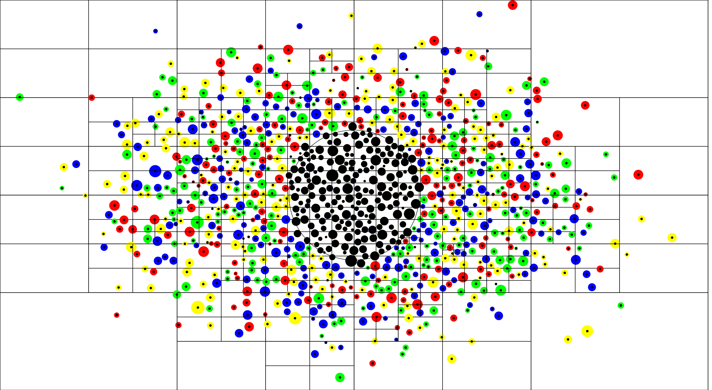
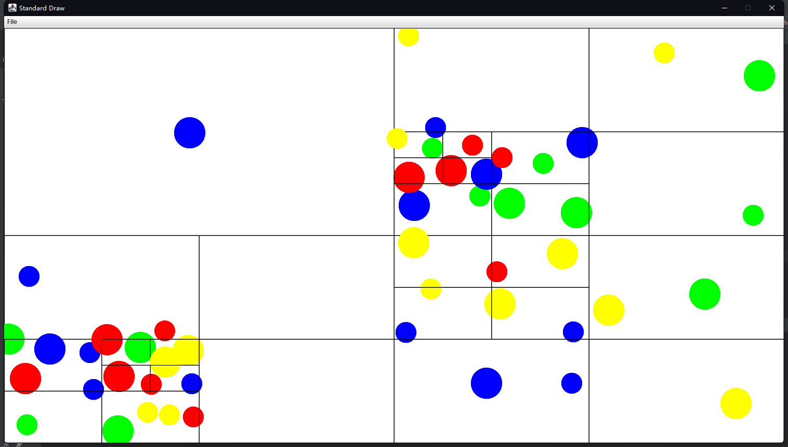
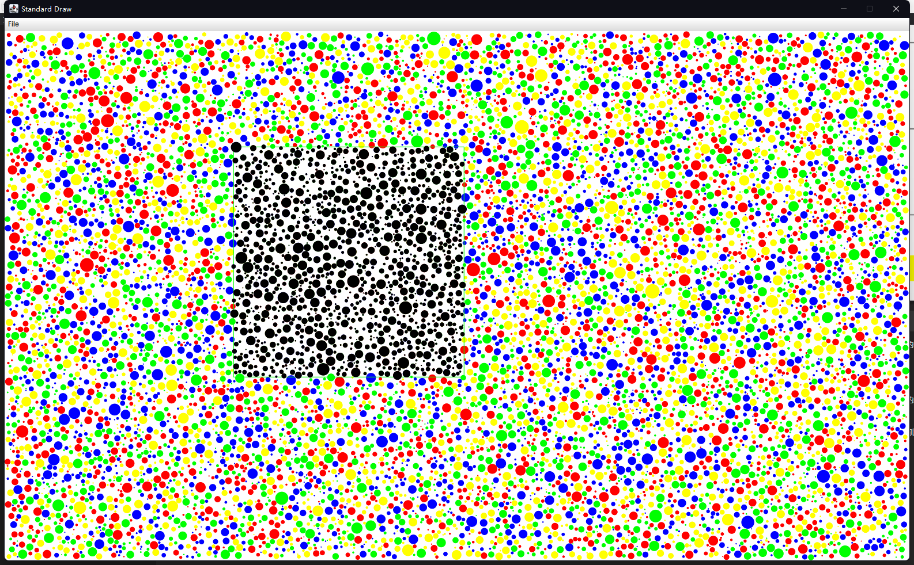
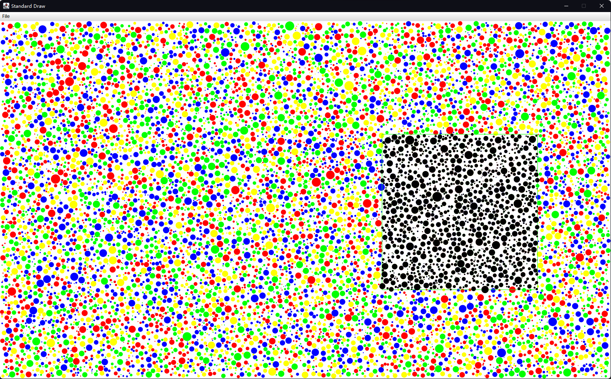
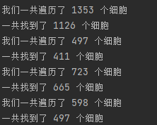
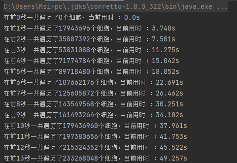
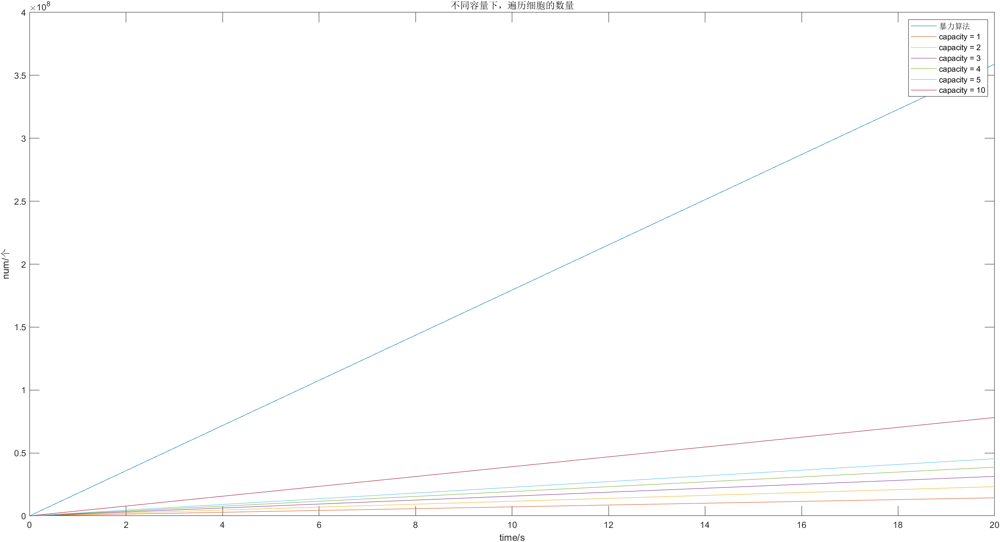
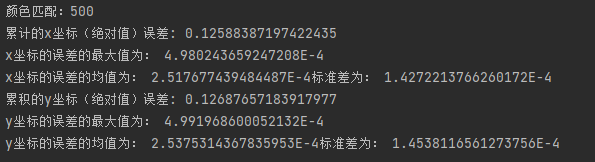
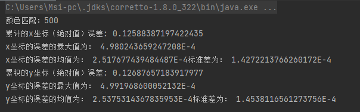

# <center>CS203B Final Project: RGBY Cell Life</center>

<center>Name&emsp;&emsp;&emsp;&emsp;&emsp;&emsp;&emsp;Student ID</center>

<center>李睿漫&emsp;&emsp;&emsp;&emsp;&emsp;&emsp;&emsp;11912837</center>

<center>仝夏瀛&emsp;&emsp;&emsp;&emsp;&emsp;&emsp;&emsp;11810734</center>

<center>汪海玉&emsp;&emsp;&emsp;&emsp;&emsp;&emsp;&emsp;12011331</center>

[toc]

## 简介


## 主要问题

### 移动


### 变换颜色


## 基于四叉树的优化

四叉树，可以看作是二叉树的“升级版”。二叉树由于只有一个维度，所以无法解决的二维的问题，而四叉树可以朝四个方向生长，故可以解决二维的问题。

本次project我们完善了四叉树的增添节点以及区域查寻的功能，从而减少了在查询某一范围内的细胞时所需遍历的细胞数量。

最终的效果如下：



> 图中黑线表示四叉树的边界，黑圈为我们的查询边界，被查询的点都被染黑以示区别。

具体的实现逻辑我们将在下一部分着重介绍。

### 基础介绍

我们设计的四叉树有以下几个property：

```java
public class QuadTree{
	Rectangle boundary; //在二维空间中四叉树的边界
    int capacity; //每一个节点容纳细胞的最大容量
    ArrayList<Cell> cells; //每一节点中存储的细胞
    QuadTree TopLeft,TopRight,BottomLeft,BottomRight; //如果当前节点满了，就会划分出四个子树。
    boolean isDivided = false; //默认状态下没有被划分。
    ....
}
```

`Rectangle`是为了表征边界的一个类，只是一个简单的长方形而已。

#### 插入

插入部分代码较长，以逻辑图代替，逻辑如下：


只有划分子树才会为新的节点开辟内存，这样可以保证只有必要时，四叉树才会向下生长，不会占用过多的内存。

为了确保插入的正确性，我们通过GUI的形式，通过鼠标点击来添加细胞，直观的模拟四叉树的生成过程，确保了插入的正确性，示意图如下：



>由于是通过鼠标点击添加的细胞，所以会有重叠。

我们可以发现细胞较为稀疏的地方没有被划分，而细胞较为密集的地方则被划分出来了更多的子树。这样就可以保证查询时，无需遍历所有的细胞，只需要在一个更小的范围内查找即可，无需遍历所有的细胞，可以有效地降低复杂度。

#### 查找

```java
public ArrayList<Cell> query(Rectangle range)
{
    ArrayList<Cell> found = new ArrayList<>(); //使用Arraylist便于添加细胞
    if (!this.boundary.intersects(range)) //如果查询区域和边界不相交，就直接返回
        return found;
    return query(range,found);//递归的查询方法

}

private ArrayList<Cell> query(Rectangle range, ArrayList found)
{
    if (!range.intersects(this.boundary))//先判断区域是否相交
        return found;
    else
    {
        if(this.cells != null) {//判断当前区域中是否包含细胞
            for (Cell cell : cells) {
                totalSearch++; // static 的 totalSearch用于记录遍历的总细胞数，用于研究性能的提升
                if (range.contains(cell)) //如果细胞的圆心在range当中
                    found.add(cell); //找到了就添进去
            }
        }
        if(this.isDivided) //如果区间被划分了，你们递归查找四个子区间
        {
            this.TopLeft.query(range,found);
            this.TopRight.query(range, found);
            this.BottomLeft.query(range, found);
            this.BottomRight.query(range, found);
        }
    }
    return found;
}
```


查找的主要逻辑是找到所有与查询区域有相交的四叉树，然后遍历所有相交四叉树中的所有细胞，找到圆心位于查询范围内的细胞。这样可以有效地减少需要需要遍历的细胞数量。从而降低复杂度。

为了校验查询是否正确，以及更加直观的展示查询的效果，我们同样通过GUI来直观的感受了一下，以鼠标为中心构造了一个正方形的查询区域，通过移动鼠标改变查询区域，并且实时的将范围内查询到的细胞染黑示意。并且我们在命令行输出了查询到的细胞数量以及遍历的细胞数量，结果如下：





图中的绿色边框随鼠标移动，且为查询区域，观察图片可以发现查询方法没有问题。



上图中总共有10000个细胞，但是可以看到我们在查询时遍历的细胞数量远小于10000，所以我们的方法是行之有效的。

#### 容量对查找的影响

在构建四叉树时，边界的选取必须根据题目要求确定，唯一能更改的便是每一个四叉树节点的容量（`capacity`），容量会显著影响四叉树的深度。

现在我们基于自己生成的数据从遍历细胞数量以及运行的时间两个维度来衡量容量对程序运行效率的影响。为了避免其他算法对此造成影响，我们仅对每个细胞的感知范围进行查询，不移动细胞，也不更改细胞的颜色，均运行15次循环，即1s。

我们取暴力算法，`capacity=1,2,3,4,5,10`进行比较，得到的输出形如：



对数据进行处理后，得到图像



我们可以发现，`capacity`越小遍历的细胞越少，这是因为他将子树发的更细，相交的区域的总面积也就越小，符合我们的直觉，但是可以想见，相应的他会占据更大的内存。此外，只要`capacity`的取值远小于细胞的总数，复杂度都在O(nlogn)级别，只有常数级的差距，所以对于消耗时间的影响不是特别大。

### 优化后的移动算法


### 优化后的变换算法


### 优化效果

我们在实际实验时发现，画布的尺寸会显著的影响作图的速度，为了控制变脸，探究优化的效果主要分为两种情况进行讨论：1.不使用GUI，纯计算。2.限定特定的画布分辨率，这里统一采用等效600*400即240000个像素的分辨率。

对于帧数我们定义为：$\frac{15}{15轮循环所需的时间}$


==我觉得主要通过运行时间来确定，可以print 10个外层循环所需的时间，如果小于等于10秒就满足要求，可以再自己生成数据找到临界10s的细胞数==

## 校验

### 测试数据的生成

为了测试程序在较多细胞下的性能，以及直观观察程序逻辑有无明显问题，我们设计了生成数据测试数据的程序。生成的数据主要取决于想要生成的数据量（细胞的数量）`num`以及细胞的面积占比`ratio`。

最终数据会输出到一个txt文件中：

```java
Out out = new Out(String.format("TestData_%d_%.2f.txt",num,ratio));
```

通过随机数生成边界：

```java
int xMax = StdRandom.uniform(100, 190); //*就随机啦
int yMax = StdRandom.uniform(80, 100);
```

然后计算平均每个细胞的半径：

```java
double Rarea = ratio * area;
double expectation = Math.sqrt(Rarea/num)/2;
double sigma = expectation / 2; //标准差越小细胞大小差距不会那么夸张
```

然后只需校验当前生成的细胞与之前生成的细胞均无相交，并且没有出界，就通过均匀分布来确定细胞的位置，正态分布来确定细胞半径。

```java
double rxTemp = StdRandom.uniform(expectation,xMax-expectation); //坐标可能还是均匀分布比较好
double ryTemp = StdRandom.uniform(expectation,yMax-expectation);
double radiusTemp = Math.abs(StdRandom.gaussian(expectation,sigma));//尽可能均匀一点吧

if(noOverLapping(xs,ys,rs,i,rxTemp,ryTemp,radiusTemp,xMax,yMax)) //xs[i] ys[i] rs[i]分别存储第i个细胞的x坐标 y坐标 半径 
{
    double percepTemp = StdRandom.uniform(radiusTemp,3*radiusTemp); //感知范围设置在1至3倍半径
    String color = colors[StdRandom.uniform(4)];  // String[] colors = {"r","g","b","y"};
    xs[i] = rxTemp;
    ys[i] = ryTemp;
    rs[i] = radiusTemp;
    out.println(xs[i]+" "+ys[i]+" "+rs[i]+" "+ percepTemp+" "+color);
    ......
}
```


### 结果校验

首先我们使用了自己的生成的数据，通过GUI进行观察，确保在移动过程中没有重叠以及对应细胞的运动方向正确。初步保证了结果的正确性。

在得到老师sample数据后，我们进行了比对。

```java
for(int i = 0; i < 500; i++)
{
    error_xs[i] = Math.abs( res_x[i] - my_x[i]);
    error_x += error_xs[i];
    error_ys[i] = Math.abs( res_y[i] - my_y[i]);
    error_y += error_ys[i];
    if(res[i].equals(my[i]))
        right++;
    else
        StdOut.println(i);

}
StdOut.println("颜色匹配：" + right);
StdOut.println("累计的x坐标（绝对值）误差: "+error_x);
StdOut.println("x坐标的误差的最大值为： "+ StdStats.max(error_xs));
StdOut.println("x坐标的误差的均值为： "+ StdStats.mean(error_xs) + "标准差为： "+StdStats.stddev(error_xs));
StdOut.println("累积的y坐标（绝对值）误差: "+error_y);
StdOut.println("y坐标的误差的最大值为： "+ StdStats.max(error_ys));
StdOut.println("y坐标的误差的均值为： "+StdStats.mean(error_ys) + "标准差为： "+StdStats.stddev(error_ys));
```


其中暴力算法`sample3`的结果如下：



颜色全部匹配，由于我们只输出了三位小数，标准差和最大误差均在10^-4^这个数量级，可以将误差视为计算机的浮点误差，结果非常理想。

使用四叉树的`sample3`的结果如下：



因为没有更改主要逻辑，只是优化了查找的范围，所以结果和我们使用暴力算法的相同，符合预期。

## 文件说明&运行指南

==说明文件结构以及如何运行我们的程序==


==**TODO：**两种启动模式需要实现以下==


`CapacityInfluence.java` : 用于实验`capacity`对程序效率的影响

`Cell.java`：封装的细胞类

`Circle.java` ：圆形的查找区域，便于定义查询范围

`DataTest.java`：由于校验统计生成的数据是否合理，输出数据的方差等

`GenTest.java`：用于生成测试数据，使用时需要改变`num`和`ratio`

`main.java`：以弃用 记得删

`main_Brute.java` ：暴力算法的main函数

`main_QuadTree.java`：四叉树算法的main函数

`QuadTree.java`：封装的四叉树类

`QuadTreeInsertShow.java`：用于展示四叉树的插入，鼠标点击插入细胞

`QuadTreeQueryShow.java`：用于展示四叉树的查询，查询范围随鼠标移动

`QuadTreeTest.java`：用于测试四叉树

`Rectangle.java`：方形的查找范围，便于定义查询范围

`ResultTest.java`：用于比对已给sample数据的输入与输出。
