# <center>CS203B Final Project: RGBY Cell Life</center>

<center>Name&emsp;&emsp;&emsp;&emsp;&emsp;&emsp;&emsp;Student ID</center>

<center>李睿漫&emsp;&emsp;&emsp;&emsp;&emsp;&emsp;&emsp;11912837</center>

<center>仝夏瀛&emsp;&emsp;&emsp;&emsp;&emsp;&emsp;&emsp;11810734</center>

<center>汪海玉&emsp;&emsp;&emsp;&emsp;&emsp;&emsp;&emsp;12011331</center>

[toc]

## 简介

本次Project通过模拟不同颜色，大小和运动方向的细胞来感受二维平面中一个经典的问题——碰撞检测。我们将说明我们程序的设计逻辑，以及测试逻辑。比通过暴力算法和四叉树算法的对比，说明四叉树的优越性。

## 主要问题

### 移动

移动过程中主要考虑这几种情况：

1. 和边界相撞
2. 和细胞相撞
3. 直接移动

使用`hitwall`按颜色分类判断细胞移动过程中是否会超出边界，若移动方向上加上细胞半径超出边界`xlim`,`ylim`则返回撞到墙时移动的最小距离，若不会撞墙则返回`-1`。

```java
private double hitWall(Cell temp) {
    if (temp.color == Color.red) {
        if (temp.ry + temp.radius >= ylim) return ylim - temp.radius - (temp.ry - steplen);
    } else if (temp.color == Color.GREEN) {
        if (temp.ry - temp.radius <= 0) return temp.ry - temp.radius + steplen;
    } else if (temp.color == Color.BLUE) {
        if (temp.rx - temp.radius <= 0) return temp.rx - temp.radius + steplen;
    } else if (temp.color == Color.YELLOW) {
        if (temp.rx + temp.radius >= xlim) return xlim - (temp.rx + temp.radius - steplen);
    }
    //do not hit wall
    return -1;
}
```

使用`hitcell`判断是否会与其他细胞相撞，若不会撞则返回`-1`，若会撞则用found数组记录细胞移动中的发生碰撞时的所有可能碰到的细胞，再用min数组记录所有需要移动的最短距离，最后对min数组排序，返回temp细胞移动的最短距离。

```java
private double hitCell(Cell temp){
        ArrayList<Double> min = new ArrayList<>();
        //Circle circle = new Circle(temp.rx, temp.ry,temp.radius);
        //ArrayList<Cell> found = quadTree.query(circle);
        ArrayList<Cell> found = new ArrayList<>();
        for(int i=0;i<cells.length;i++){
            if(temp.ID==cells[i].ID){}//不和自己比
            else {
                if(getDistance(temp,cells[i]) < cells[i].radius+temp.radius)//会撞，记录cell
                    found.add(cells[i]);
            }
        }

        for(int i=0;i<found.size();i++){
            min.add(getMinDis(found.get(i),temp));
        }
        if(min.size()>0) {
            min.sort(Comparator.naturalOrder());
            return min.get(0);//对所有的可能会撞的cell进行记录，排序，并返回最短距离。
        }
        return -1;
    }
```

关于如何计算细胞移动的最短距离：根据颜色分类后，细胞的移动情况较为简单，可以直接用勾股定理求出移动距离。

```java
private double getMinDis(Cell cell,Cell temp){
        if(temp.color == Color.RED)
            return cell.ry-(temp.ry-steplen)-Math.sqrt((cell.radius+temp.radius)*(cell.radius+temp.radius)-(cell.rx-temp.rx)*(cell.rx-temp.rx) );
        else if(temp.color==Color.GREEN)
            return temp.ry+steplen-cell.ry-Math.sqrt((cell.radius+temp.radius)*(cell.radius+temp.radius)-(cell.rx-temp.rx)*(cell.rx-temp.rx) );
        else if(temp.color==Color.BLUE)
            return temp.rx+steplen-cell.rx-Math.sqrt((cell.radius+temp.radius)*(cell.radius+temp.radius)-(cell.ry-temp.ry)*(cell.ry-temp.ry) );
        else if(temp.color==Color.YELLOW)
            return cell.rx-(temp.rx-steplen)-Math.sqrt((cell.radius+temp.radius)*(cell.radius+temp.radius)-(cell.ry-temp.ry)*(cell.ry-temp.ry) );

        return -1;
    }
```

若没有相撞情况则普通按照颜色移动细胞：

```java
private void moveOneStep(Cell cell)
{
    if(cell.color == Color.RED){
        cell.ry += steplen;
    }
    else if(cell.color==Color.GREEN){
        cell.ry += -steplen;
    }
    else if(cell.color==Color.BLUE){
        cell.rx += -steplen;
    }
    else if(cell.color==Color.YELLOW){
        cell.rx += steplen;
    }
}
```

### 变换颜色

所有细胞一轮移动结束之后，细胞开始扫描在自己感知范围里的细胞，并记录各个颜色细胞的数量。根据规则，感知规则是以细胞圆心为中心、`perception range`的两倍为边长的正方形，与该正方形相切的细胞即算作在感知范围里。

所有细胞扫描完成之后细胞分别根据周围细胞颜色数量情况进行颜色改变，具体规则如下：

```pseudocode
if(RED cell){
    if(at least 3 red cells in its perception range (excluding itself),
       and the percentage of red cells is greater than 70% (excluding itself))
        turn GREEN;
    else if( at least 1 yellow cell in its perception range, 
            and the percentage of yellow cells is lesser than 10%)
        turn YELLOW;
}
else if(GREEN cell){
    if( at least 3 green cells in its perception range (excluding itself), 
       and the percentage of green cells is greater than 70%)
        turn BLUE;
    else if(at least 1 red cell in its perception range,
            and the percentage of red cells is lesser than 10%)
        turn Color.RED;
}
else if(BLUE cell){
    if(at least 3 blue cells in its perception range (excluding itself),
       and the percentage of blue cells is greater than 70%)
        turn YELLOW;
    else if(at least 1 green cell in its perception range, 
            and the percentage of green cells is lesser than 10%)
        turn GREEN;
}
else {
    if( at least 3 yellow cells in its perception range (excluding itself), 
       and the percentage of yellow cells is greater than 70%(excluding itself))
        turn RED;
    else if( at least 1 blue cell in its perception range, 
            and the percentage of blue cells is lesser than 10%)
        turn BLUE;
}
```


## 基于四叉树的优化

四叉树，可以看作是二叉树的“升级版”。二叉树由于只有一个维度，所以无法解决的二维的问题，而四叉树可以朝四个方向生长，故可以解决二维的问题。

本次project我们完善了四叉树的增添节点以及区域查寻的功能，从而减少了在查询某一范围内的细胞时所需遍历的细胞数量，以此达到优化的目的。

最终的效果如下：

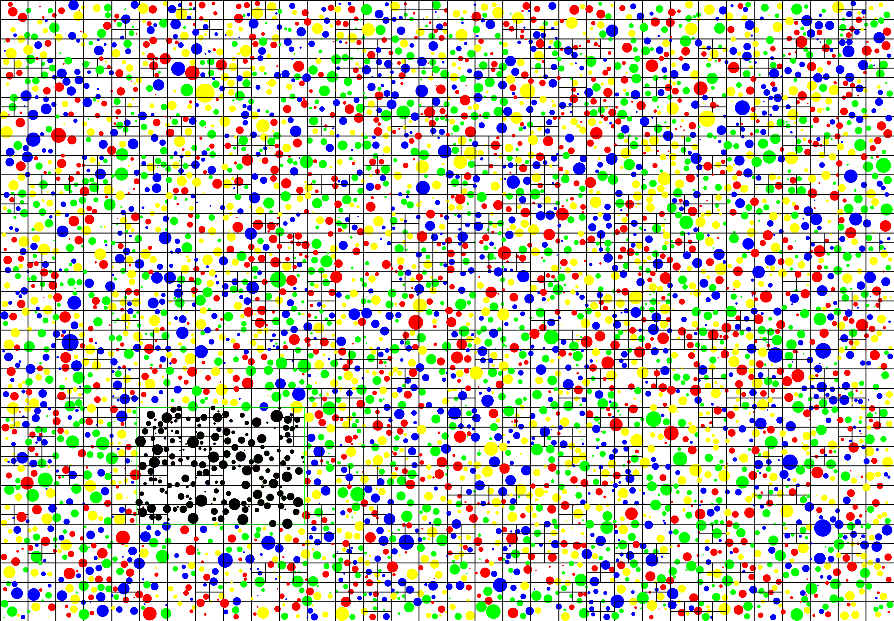

> 图中黑线表示四叉树的边界，绿方框为我们的查询边界，被查询的细胞都被染黑以示区别。

具体的实现逻辑我们将在下一部分着重介绍。

### 基础介绍

我们设计的四叉树有以下几个property：

```java
public class QuadTree{
	Rectangle boundary; //在二维空间中四叉树的边界
    int capacity; //每一个节点容纳细胞的最大容量
    ArrayList<Cell> cells; //每一节点中存储的细胞
    QuadTree TopLeft,TopRight,BottomLeft,BottomRight; //如果当前节点满了，就会划分出四个子树。
    boolean isDivided = false; //默认状态下没有被划分。
    ....
}
```

`Rectangle`是为了表征边界的一个类，只是一个简单的长方形而已。

#### 插入

插入部分代码较长，以逻辑图代替，逻辑如下：


只有划分子树才会为新的节点开辟内存，这样可以保证只有必要时，四叉树才会向下生长，不会占用过多的内存。

为了确保插入的正确性，我们通过GUI的形式，通过鼠标点击来添加细胞，直观的模拟四叉树的生成过程，确保了插入的正确性，示意图如下：

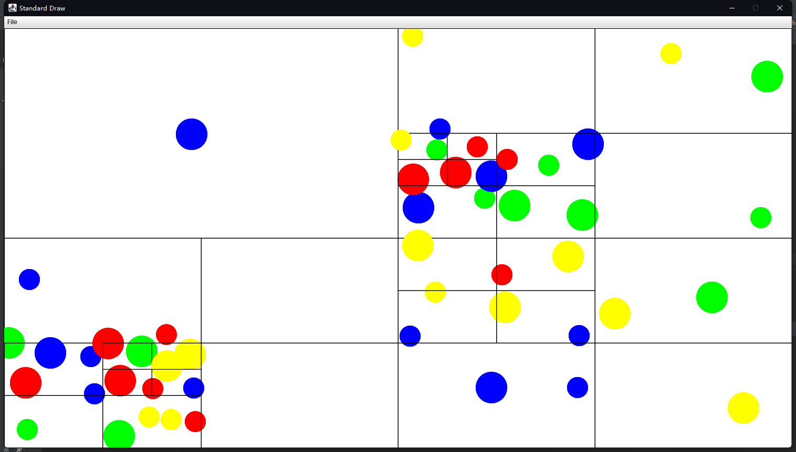

>程序为`QuadTreeInsertShow.java`由于是通过鼠标点击添加的细胞，所以会有重叠。

我们可以发现细胞较为稀疏的地方没有被划分，而细胞较为密集的地方则被划分出来了更多的子树。这样就可以保证查询时，无需遍历所有的细胞，只需要在一个更小的范围内查找即可，无需遍历所有的细胞，可以有效地降低复杂度。

#### 查找

```java
public ArrayList<Cell> query(Rectangle range)
{
    ArrayList<Cell> found = new ArrayList<>(); //使用Arraylist便于添加细胞
    if (!this.boundary.intersects(range)) //如果查询区域和边界不相交，就直接返回
        return found;
    return query(range,found);//递归的查询方法

}

private ArrayList<Cell> query(Rectangle range, ArrayList found)
{
    if (!range.intersects(this.boundary))//先判断区域是否相交
        return found;
    else
    {
        if(this.cells != null) {//判断当前区域中是否包含细胞
            for (Cell cell : cells) {
                totalSearch++; // static 的 totalSearch用于记录遍历的总细胞数，用于研究性能的提升
                if (range.contains(cell)) //如果细胞的圆心在range当中
                    found.add(cell); //找到了就添进去
            }
        }
        if(this.isDivided) //如果区间被划分了，你们递归查找四个子区间
        {
            this.TopLeft.query(range,found);
            this.TopRight.query(range, found);
            this.BottomLeft.query(range, found);
            this.BottomRight.query(range, found);
        }
    }
    return found;
}
```

查找的主要逻辑是找到所有与查询区域有相交的四叉树，然后遍历所有相交四叉树中的所有细胞，找到圆心位于查询范围内的细胞。这样可以有效地减少需要需要遍历的细胞数量。从而降低复杂度。

#### 四叉树的检验

四叉树是我们优化的核心数据结构，如果四叉树的插入或者查询方法有问题，将会导致严重的问题，因此，在使用这一数据结构之前必须经过严苛的检验，我使用的方法是通过大量数据结合GUI进行直观的观测。

首先是插入：

通过鼠标点击来添加细胞，直观的模拟四叉树的生成过程，确保了插入的正确性，示意图如下：

初始时，区域是空白的：

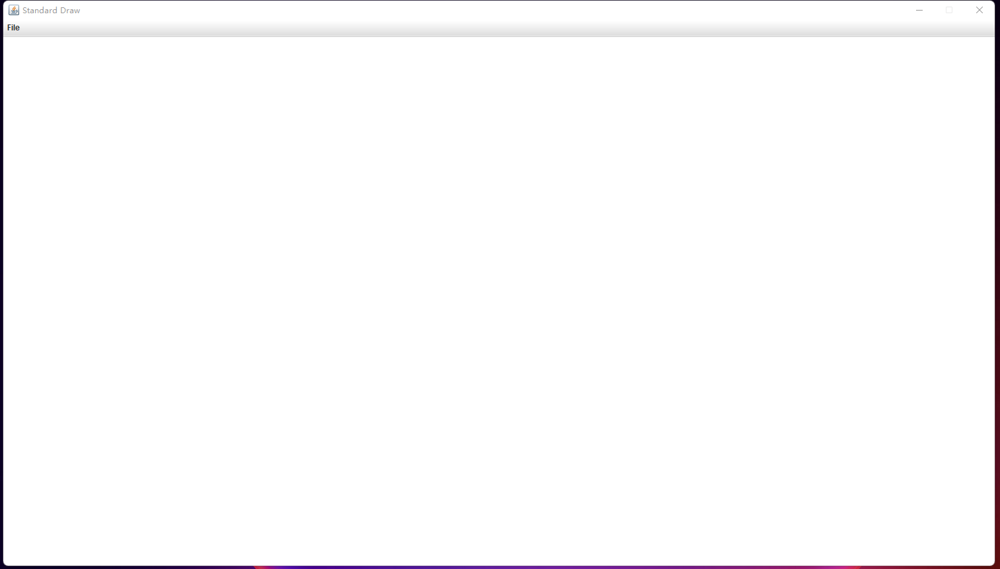

当我们添加一个细胞后，便会生成四叉树，直观的体现为边界多了边界线：

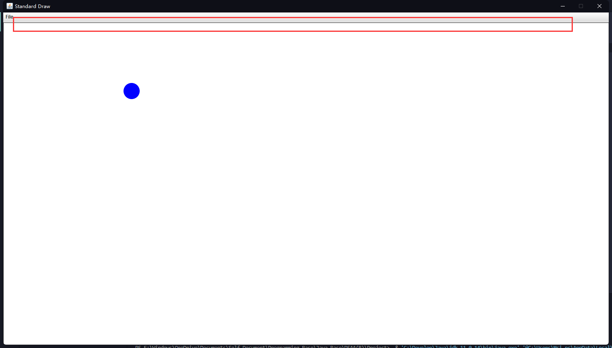

此时我们设置的四叉树每一个节点的容量为4，当添加第五个细胞时变化划分出四个子节点，并将该细胞添加到划分的子节点中：

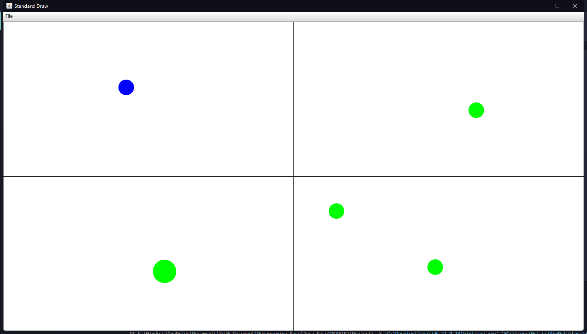

我们继续添加细胞，可以看到对应的区域继续生成子树，符合我们的设计，说明插入算法没有问题

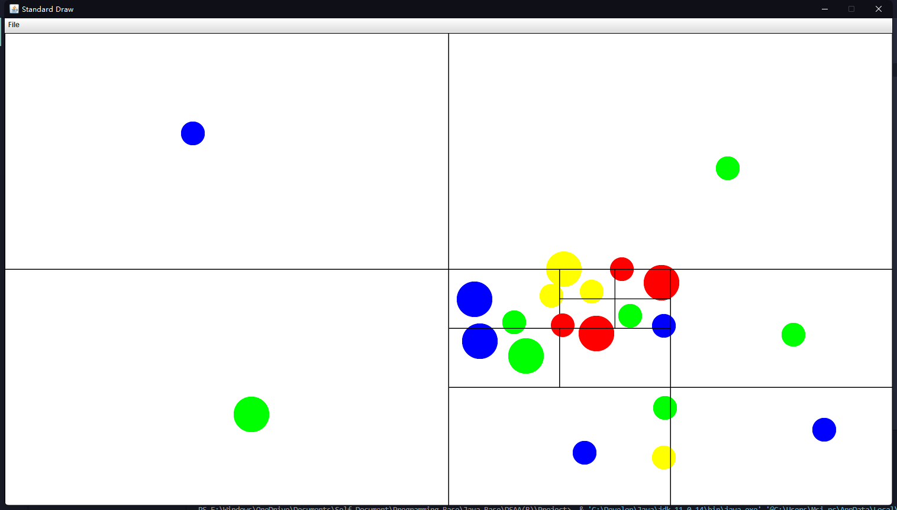

接下来我们验证查找算法，我是用[自己生成的包含有10000个细胞的测试数据](#测试数据的生成)，和以鼠标为中心构造了一个正方形的查询区域，通过移动鼠标改变查询区域实现动态的查询，并且实时的将范围内查询到的细胞染黑示意。并且我们在命令行输出了查询到的细胞数量以及遍历的细胞数量，结果如下：

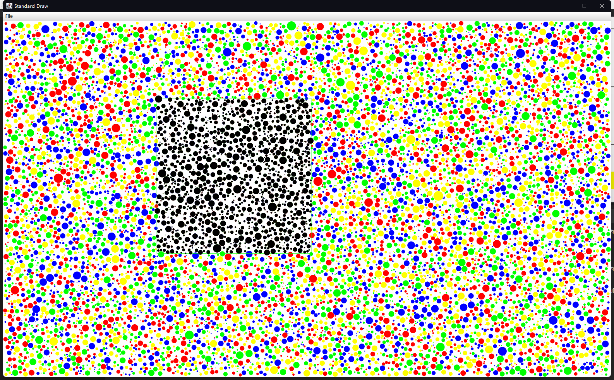

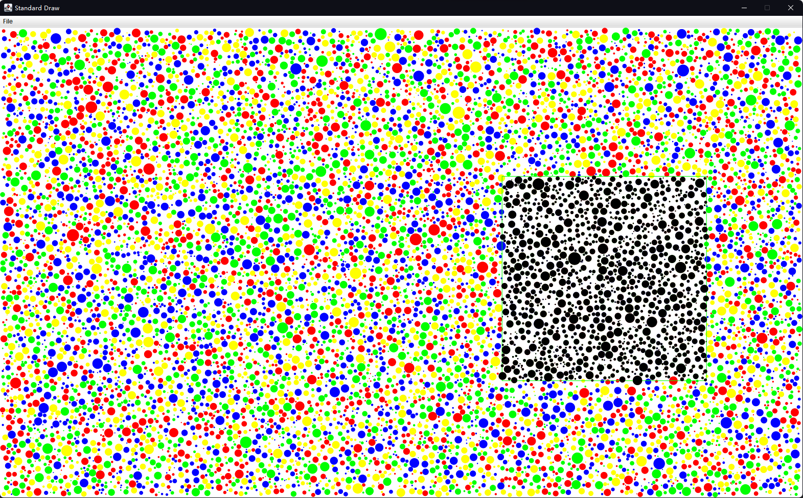

> 程序为：`QuadTreeQueryShow.java`

图中的绿色边框随鼠标移动，且为查询区域，观察图片可以发现只有圆心位于查询范围内的细胞才被检索到了，查询方法没有问题。

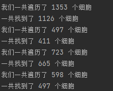

上图中总共有10000个细胞，但是可以看到我们在查询时遍历的细胞数量远小于10000，所以我们的方法是行之有效的。

#### 容量对查找的影响

在构建四叉树时，边界的选取必须根据题目要求确定，唯一能更改的便是每一个四叉树节点的容量（`capacity`），容量会显著影响四叉树的深度。从而增加查找算法递归的层数，但是更细的划分区域也会减少相交区域的总面积，从而减少便利的细胞的数量。

现在我们基于自己生成的数据从遍历细胞数量以及运行的时间两个维度来衡量容量对程序运行效率的影响。为了避免其他算法对此造成影响，我们仅对每个细胞的感知范围进行查询，不移动细胞，也不更改细胞的颜色，均运行15次循环，即1s。

我们取暴力算法，`capacity=1,2,3,4,5,10`进行比较，得到的输出形如：

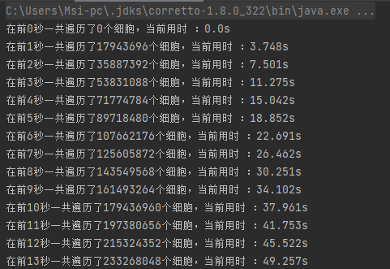

对数据进行处理后，得到图像

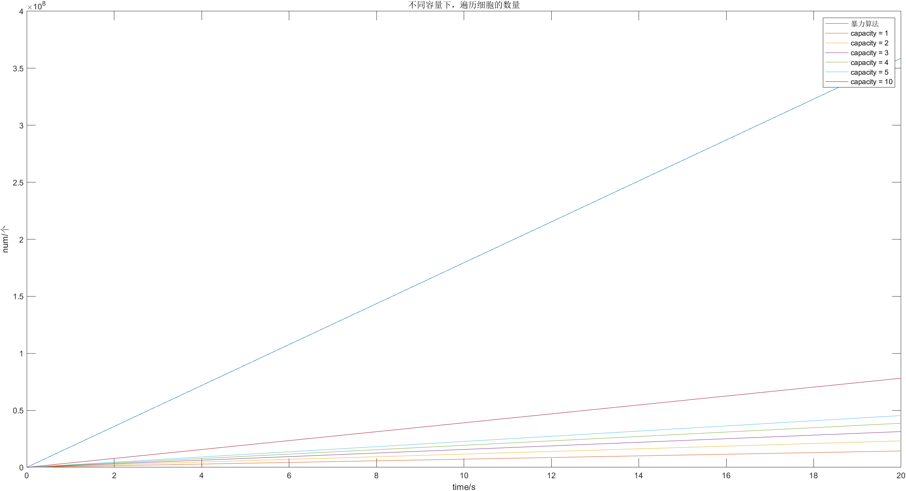

我们可以发现，`capacity`越小遍历的细胞越少，这是因为他将子树发的更细，相交的区域的总面积也就越小，符合我们的直觉，但是可以相见，相应的他会占据更大的内存。此外，只要`capacity`的取值远小于细胞的总数，复杂度都在O(nlogn)级别，只有常数级的差距。在运行时间上，`capacity`从0变化到10时间几乎没有变化，故不再多展示。

因此，如果我们追求极致的性能，那么应该设置四叉树的每个子节点的容量为1。

### 优化后的移动算法

总体逻辑不变，只是引入四叉树，缩小了细胞的遍历范围，从而达到了降低复杂度的目的。


若每次移动细胞后，细胞不在原来的四叉树区域内，则重新生成一个`quadTree`：

```java
private void moveAllCells()
{
    for(int i=0;i<cells.length;i++){
        moveCell(cells[i]);

        if(!cells[i].location.boundary.contains(cells[i])) {
            quadTree = new QuadTree(quadTree.boundary, quadTree.capacity, cells);

        }
    }

}
```

此后每次查询是否有会相撞可能的细胞时，只需要查询以自己为圆心，以`cell.radius+steplen+maxRadius`为半径的搜索范围，其中maxRadius是所有细胞中的最大半径。

```java
private double hitCell(Cell cell,Cell temp){
    ArrayList<Double> min = new ArrayList<>();
    Circle circle = new Circle(cell.rx, cell.ry,cell.radius+steplen+maxRadius);
    //ArrayList<Cell> found = quadTree.query(circle);
    ArrayList<Cell> found = new ArrayList<>();

    //得到可能会撞的cell
    found = quadTree.query(circle);

    //计算移动距离
    for(int i=0;i<found.size();i++){
        //排除自己，得到可能会撞的cell并计算移动距离
        if(!found.get(i).equals(cell)&&getDistance(found.get(i),temp)<found.get(i).radius+temp.radius)
            min.add(getMinDis(found.get(i),temp));
    }
    //获得最小移动距离
    if(min.size()>0) {
        min.sort(Comparator.naturalOrder());
        return min.get(0);
    }
    return -1;
}
```

### 优化后的变换算法

颜色变换分为两步，第一步是依次扫描各个细胞感知范围内的细胞并记录颜色数量，第二步是细胞根据颜色数量进行颜色变换。

我们在cell里添加了以下几个property：

```java
public class Cell {
    int Rcount = 0;//记录红色cell数量
    int Gcount = 0;//记录绿色cell数量
    int Bcount = 0;//记录蓝色cell数量
    int Ycount = 0;//记录黄色cell数量
    ....
}
```

在第一步中，我们遍历每个cell进行扫描。

对于当前细胞`cells[i]`，首先进行颜色数量数据清零，以记录当前状态下的颜色数据。

```java
 //清零之前的数据
 cells[i].Rcount=0;
 cells[i].Gcount=0;
 cells[i].Bcount=0;
 cells[i].Ycount=0;
```

为找到感知范围内细胞，我们先创建一个以当前细胞圆心为中心的`rectangle`，调用`quadTree.query(rectangle)`方法找到与`rectangle`相交的四叉树里的所有细胞，并记录在`ArrayList<Cell> found`中。为确保`found`包含所有可能在感知范围内的细胞，我们将`rectangle`的边长设置为`cells[i].perceptionRange+maxRadius`，其中`maxRadius`是所有细胞中的最大半径。

```java
//确定搜寻范围，一个以感知范围和最大细胞半径的和为边长的矩形
Rectangle rectangle = new Rectangle(cells[i].rx, cells[i].ry,
                      cells[i].perceptionRange+maxRadius,cells[i].perceptionRange+maxRadius);
//得到在与搜寻范围相交的四叉树里的所有细胞
ArrayList<Cell> found = quadTree.query(rectangle);
```

接下来我们在`found`里寻找在感知范围内的细胞，通过`isInRange(cells[i],found.get(j)`方法判断`found.get(j)`是否在`cells[i]`的感知范围内，如果在就记录`found.get(j)`的颜色。

```java
for (int j = 0; j < found.size(); j++) {
     //判断细胞是否在感知范围里
     if(isInRange(cells[i],found.get(j))){
         //记录细胞颜色数量
         if (found.get(j).color == Color.RED)
             cells[i].Rcount++;
         else if (found.get(j).color == Color.GREEN)
              cells[i].Gcount++;
         else if (found.get(j).color == Color.BLUE)
               cells[i].Bcount++;
         else
               cells[i].Ycount++;
}
```

找到所有在感知范围内的细胞之后，由于颜色变换规则里不计算细胞本身，所以我们需要减去`cells[i]`的颜色。

```java
//减去自己
if (cells[i].color == Color.RED)
    cells[i].Rcount--;
 else if (cells[i].color == Color.GREEN)
    cells[i].Gcount--;
else if (cells[i].color == Color.BLUE)
     cells[i].Bcount--;
else
      cells[i].Ycount--;
}
```

扫描完成之后，遍历细胞进行颜色变换。

```java
//扫描完成，细胞颜色改变
for (int i = 0; i < cells.length; i++) {
    changeColor(cells[i]);
}
```

```java
private void changeColor(Cell cell){
    //根据4个count来变化颜色
    if(cell.color== Color.RED){
        if(cell.Rcount>=3 && (double)cell.Rcount/(cell.Rcount+cell.Gcount+cell.Bcount+cell.Ycount)>0.7)
            cell.color = Color.GREEN;
        else if(cell.Ycount>=1 && (double)cell.Ycount/(cell.Rcount+cell.Gcount+cell.Bcount+cell.Ycount)<0.1)
            cell.color = Color.YELLOW;
     }
     else if(cell.color==Color.GREEN){
         if(cell.Gcount>=3 && (double)cell.Gcount/(cell.Rcount+cell.Gcount+cell.Bcount+cell.Ycount)>0.7)
             cell.color = Color.BLUE;
         else if(cell.Rcount>=1 && (double)cell.Rcount/(cell.Rcount+cell.Gcount+cell.Bcount+cell.Ycount<0.1)
             cell.color = Color.RED;
     }
     else if(cell.color==Color.BLUE){
         if(cell.Bcount>=3 && (double)cell.Bcount/(cell.Rcount+cell.Gcount+cell.Bcount+cell.Ycount)>0.7)
             cell.color = Color.YELLOW;
         else if(cell.Gcount>=1 && (double)cell.Gcount/(cell.Rcount+cell.Gcount+cell.Bcount+cell.Ycount<0.1)
             cell.color = Color.GREEN;
     }
     else {
         if(cell.Ycount>=3 && (double)cell.Ycount/(cell.Rcount+cell.Gcount+cell.Bcount+cell.Ycount)>0.7)
             cell.color = Color.RED;
         else if(cell.Bcount>=1 && (double)cell.Bcount/(cell.Rcount+cell.Gcount+cell.Bcount+cell.Ycount<0.1)
             cell.color = Color.BLUE;
     }
```

### 细节优化

我们发现当细胞较为稀疏时，是不会满足变换颜色的条件的。具体而言，就是搜索到的细胞数量少于4个（包含自身），就不可能满足任何条件，可以直接跳过。即：

```java
if(found.size() < 4) continue;
```

当细胞较为稀疏的时候可以极大程度上提高运行的速度。

此外，一般的，当系统内只要有一个物体移动，就需要重建四叉树，虽然插入的复杂度为O(n)，小于搜索的复杂度O(nlgn)，但是如果减少四叉树重建的频次，仍然可以起到一定的优化效果，对此，我们为每个细胞添加了新的属性，即其所属的四叉树节点,再插入时就会指定。

```java
public class Cell{
    
QuadTree location;
    ......
}

public class QuadTree{
    ......
    public boolean insert(Cell cell){
        .......
        if(this.cells.size() < this.capacity)//如果节点没满
        {
            this.cells.add(cell);//将细胞存入此节点
            cell.location = this; //此节点即为细胞所在的位置
            return true;
        }
    }
    ......
}
```

然后只有在细胞离开了所属的节点的边界，才会重新构造子树，即：

```java
for(int i=0;i<cells.length;i++)
{    
    moveCell(cells[i]);
    if(!cells[i].location.boundary.contains(cells[i])) {//当细胞所在的节点的边界不再包含此细胞时：
        quadTree = new QuadTree(quadTree.boundary, quadTree.capacity, cells);//重新构建quadtree，并将所有的细胞再次存入新的quadtree
    }
}
```

### 优化效果

我们在实际实验时发现，画布的尺寸会显著的影响作图的速度，为了控制变脸，探究优化的效果主要分为两种情况进行讨论：1.不使用GUI，纯计算。2.限定特定的画布分辨率，这里统一采用等效600*400即240000个像素的分辨率。

对于帧数我们定义为：$\frac{15}{完成15轮计算所需的时间}$

> 我们最后提交的代码添加了帧数限制，即：
>
> ```java
> private void loopGUI(Stopwatch stopwatch){
>     ......
>     double t0 = stopwatch.elapsedTime();//该轮循环开始的时间
>     StdDraw.clear();
>     moveAllCells();
>     changeAllColor();
>     drawAllCells();
>     double t3 = stopwatch.elapsedTime();//该轮循环结束的时间
>     if(t3 - t0 < 1.0/15) StdDraw.pause((int)(1000*(1.0/15 - (t3 - t0))));//限制帧数为15帧
> }
> ```
>
> 故无法得到大于15帧的帧数了

使用暴力算法时，运行1500个细胞帧率在15左右


使用四叉树时，运行3000个细胞帧率在15左右


统计细胞数量和帧数的关系，因为画图也要消耗时间，只跑代码不画图的情况如下：


同时也要画图时情况如下：


从上分析可以看到使用四叉树算法程序得到了明显优化，并且画图明显拖慢了程序的运行，如果画图的时间消耗的数量级与移动和变色在同一量级的话，理论上在10000个细胞同样可以到达每秒15次移动的标准，即15帧。

## 校验

### 测试数据的生成

为了测试程序在较多细胞下的性能，以及直观观察程序逻辑有无明显问题，我们设计了生成数据测试数据的程序。生成的数据主要取决于想要生成的数据量（细胞的数量）`num`以及细胞的面积占比`ratio`。

最终数据会输出到一个txt文件中：

```java
Out out = new Out(String.format("TestData_%d_%.2f.txt",num,ratio));
```

通过随机数生成边界：

```java
int xMax = StdRandom.uniform(100, 190); //*就随机啦
int yMax = StdRandom.uniform(80, 100);
```

然后计算平均每个细胞的半径：

```java
double Rarea = ratio * area;
double expectation = Math.sqrt(Rarea/num)/2;
double sigma = expectation / 2; //标准差越小细胞大小差距不会那么夸张
```

然后只需校验当前生成的细胞与之前生成的细胞均无相交，并且没有出界，就通过均匀分布来确定细胞的位置，正态分布来确定细胞半径。

```java
double rxTemp = StdRandom.uniform(expectation,xMax-expectation); //坐标可能还是均匀分布比较好
double ryTemp = StdRandom.uniform(expectation,yMax-expectation);
double radiusTemp = Math.abs(StdRandom.gaussian(expectation,sigma));//尽可能均匀一点吧

if(noOverLapping(xs,ys,rs,i,rxTemp,ryTemp,radiusTemp,xMax,yMax)) //xs[i] ys[i] rs[i]分别存储第i个细胞的x坐标 y坐标 半径 
{
    double percepTemp = StdRandom.uniform(radiusTemp,3*radiusTemp); //感知范围
    String color = colors[StdRandom.uniform(4)];  // String[] colors = {"r","g","b","y"};
    xs[i] = rxTemp;
    ys[i] = ryTemp;
    rs[i] = radiusTemp;
    out.println(xs[i]+" "+ys[i]+" "+rs[i]+" "+ percepTemp+" "+color);
    ......
}
```


### 结果校验

首先我们使用了自己的生成的数据，通过GUI进行观察，确保在移动过程中没有重叠以及对应细胞的运动方向正确。初步保证了结果的正确性。

在得到老师sample数据后，我们进行了比对。

```java
for(int i = 0; i < 500; i++)
{
    error_xs[i] = Math.abs( res_x[i] - my_x[i]);
    error_x += error_xs[i];
    error_ys[i] = Math.abs( res_y[i] - my_y[i]);
    error_y += error_ys[i];
    if(res[i].equals(my[i]))
        right++;
    else
        StdOut.println(i);

}
StdOut.println("颜色匹配：" + right);
StdOut.println("累计的x坐标（绝对值）误差: "+error_x);
StdOut.println("x坐标的误差的均值为： "+ StdStats.mean(error_xs) + "标准差为： "+StdStats.stddev(error_xs));
StdOut.println("累积的y坐标（绝对值）误差: "+error_y);
StdOut.println("y坐标的误差的均值为： "+StdStats.mean(error_ys) + "标准差为： "+StdStats.stddev(error_ys));
```

其中暴力算法`sample3`的结果如下：

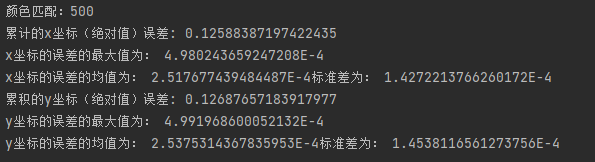

颜色全部匹配，由于我们只输出了三位小数，标准差和最大误差均在10^-4^这个数量级，说明我们的结果的前三位小数完全匹配，结果非常理想。

使用四叉树的`sample3`的结果如下：

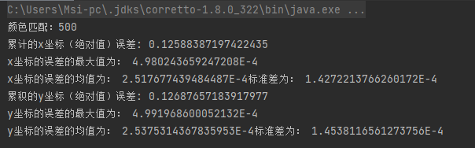

因为没有更改主要逻辑，只是优化了查找的范围，所以结果和我们使用暴力算法的相同，符合预期。

## 文件说明&运行指南

### 程序结构

`project/src`中的文件如下：

+ `CapacityInfluence.java` : 用于实验`capacity`对程序效率的影响
+ `Cell.java`：封装的细胞类
+ `Circle.java` ：圆形的查找区域，便于定义查询范围
+ `DataTest.java`：由于校验统计生成的数据是否合理，输出数据的方差等
+ `GenTest.java`：用于生成测试数据，使用时需要改变`num`和`ratio``
+ ``main_Brute.java` ：暴力算法的main函数
+ `main_QuadTree.java`：四叉树算法的main函数
+ `QuadTree.java`：封装的四叉树类
+ `QuadTreeInsertShow.java`：用于展示四叉树的插入，鼠标点击插入细胞
+ `QuadTreeQueryShow.java`：用于展示四叉树的查询，查询范围随鼠标移动
+ `QuadTreeTest.java`：用于测试四叉树
+ `Rectangle.java`：方形的查找范围，便于定义查询范围
+ `ResultTest.java`：用于比对已给sample数据的输入与输出。

### How to run

1. 在命令行中打开`Project`文件夹。
2. 因为实时帧数在命令行输出，需要改为UTF-8编码。cmd输入： `CHCP 65001`
3. 编译`src`文件夹中的所有java文件：`javac -cp lib\algs4.jar  -encoding utf-8 src\*.java -d bin`
4. 运行`main-QuadTree`,指定模式，并重定向输入：
   1. GUI模式：只需要重定向输入，无需多余参数：`java -cp bin;lib\algs4.jar main_QuadTree < sample3.txt`
   2. Terminal模式：`java -cp bin;lib\algs4.jar main_QuadTree --terminal < sample3.txt`

效果展示：

GUI模式：

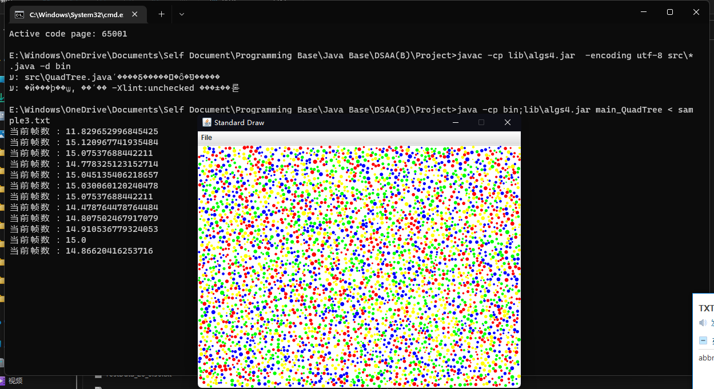

Terminal模式

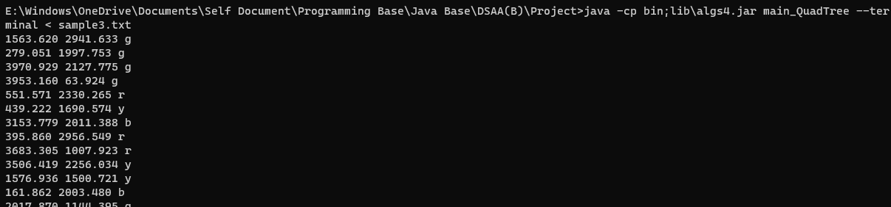

Github 项目地址：https://github.com/Smangic/DSAA-B-Final-Project

